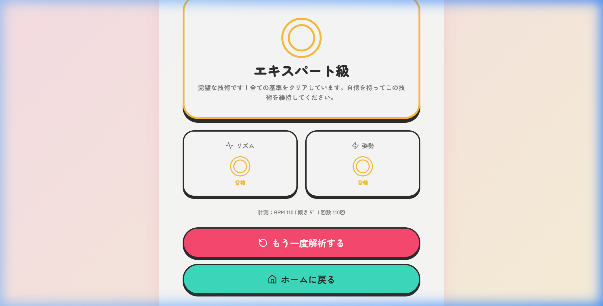
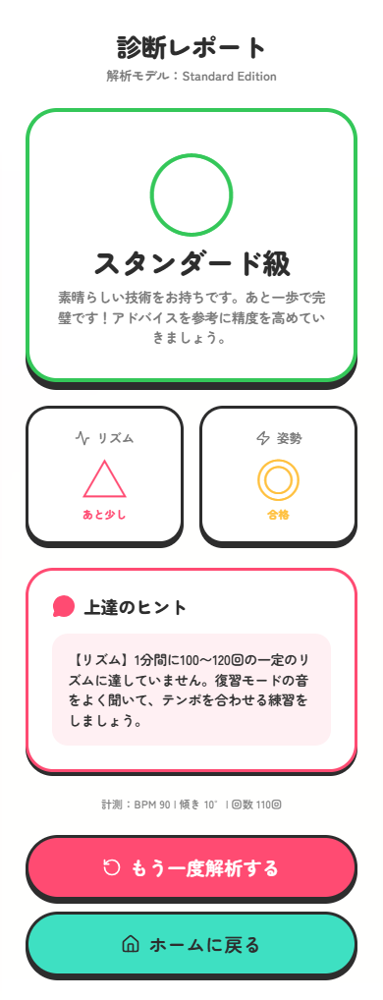
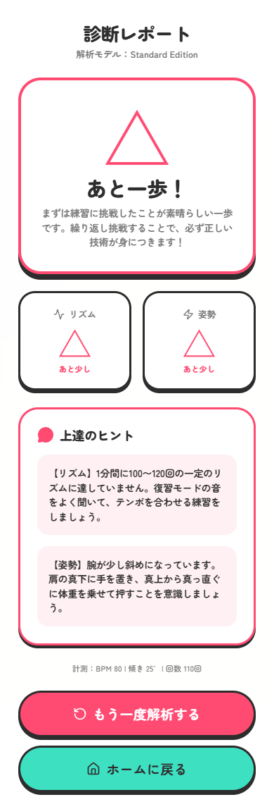

# 胸骨圧迫マスター アプリケーション概要資料

## 1. アプリケーションの目的
本アプリケーションは、**「市民が救命講習を受講した後の自主的な復習」** を支援するために開発されました。
救命講習で学んだ「胸骨圧迫（心臓マッサージ）」の技術は、時間の経過とともに忘れてしまいがちです。本アプリを使用することで、いつでもどこでもスマートフォン1つで、正しいリズムと姿勢の自己評価が可能になります。

---

## 2. 主な機能と使い方

本アプリには、手軽に練習できる「姿勢復習モード」と、より厳密に評価を行う「ビデオ精密評価モード」の2つの機能があります。

### ① 姿勢復習モード（手軽な自己練習）
スマートフォンの画面に表示されるガイドイラストと、最適なテンポ（110BPM）を刻むリズム音に合わせて胸骨圧迫の練習を行います。
直感的なUIで、正しい体重のかけ方や腕の角度を視覚的に復習できます。

### ② ビデオ精密評価モード（AIによる本格的な動作解析）
ユーザーが自身の胸骨圧迫を真横から撮影した動画（約20秒）を読み込ませることで、Googleの最新AIモデル（MediaPipe Pose）が骨格を自動検出し、圧迫の「リズム」と「腕の垂直度」を精密に評価します。

> **【ビデオ評価の手順】**
> 1. トップ画面から「ビデオで精密評価」を選択。
> 2. 事前に撮影した胸骨圧迫の動画（真横から全身を写したもの）を選択。
> 3. AIによる骨格解析がスタート。
> 4. 解析完了後、詳細な診断レポートが表示されます。

---

## 3. 診断レポート（UIパターンの解説）

AIによる解析結果は、ユーザーのモチベーションを下げないよう、ポジティブで分かりやすい3段階の「級」で表示されます。姿勢やリズムが基準に満たない場合は、具体的なアドバイスが提示されます。

### パターンA：エキスパート級（すべての基準をクリア）
リズム（100〜120回/分）と姿勢（腕の傾き20度以内）の**両方が完璧**な場合の表示です。
達成感を高めるため、ゴールドのカラーリングと紙吹雪のアニメーションで最高評価を演出します。

### パターンB：スタンダード級（どちらか1つが基準外）
リズムまたは姿勢の**どちらか一方が惜しくも基準に満たなかった場合**の表示です。
「素晴らしい技術をお持ちです」と肯定しつつ、不足していた項目に対する具体的なアドバイス（例：「音をよく聞いて練習しましょう」）を表示し、次のステップアップを促します。

### パターンC：あと一歩！（両方が基準外）
リズムと姿勢の**両方が基準に満たなかった場合**の表示です。
「トレーニングが必要」「不合格」といったネガティブな表現を避け、**「まずは練習に挑戦したことが素晴らしい一歩です」** とユーザーの行動自体を称賛します。その上で、どこを直せば良いのか（リズムと姿勢の両方のアドバイス）を優しく提示します。

---

## 4. 期待される効果
*   **技術維持率の向上**: 定期的な自己評価により、講習内容の忘却を防ぎます。
*   **心理的ハードルの低下**: いつでもゲーム感覚で評価を受けられるため、トレーニングへの参加意欲が高まります。
*   **質の高い救命処置の普及**: 正しい姿勢とリズムが身につくことで、実際の救急現場での救命率向上に貢献します。
